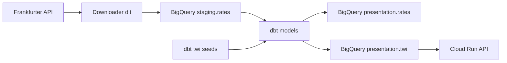

# Foreign exchange DBT project in Google Cloud/BigQuery
[](https://github.com/rboyes/forex/actions/workflows/daily-pipeline.yml) [](https://github.com/rboyes/forex/actions/workflows/dbt-docs.yml) [](https://github.com/rboyes/forex/actions/workflows/api-deploy.yml)

Daily pipeline that pulls historical FX rates from Frankfurter, loads them into
BigQuery staging, and builds presentation models (rates + TWI = trade weighted index) with dbt.
The trade weighted index is then made available via a cloud run API. 
Runs via GitHub Actions and keeps incremental history by date.



DBT documents are located at [dbt docs](https://rboyes.github.io/forex).

## Google cloud setup

- Google cloud project created - call it forex-20260115
  ```bash
  gcloud projects create forex-20260115 --name="forex"
  ```
- Install terraform
- Google cloud admin service account created for project deployment - call it terraform-runner
  ```bash
  # Create service account
  gcloud iam service-accounts create terraform-runner \
    --project forex-20260115 \
    --display-name "Terraform runner"

  # Grant granular permissions (Least Privilege)
  for role in \
    roles/serviceusage.serviceUsageAdmin \
    roles/iam.serviceAccountAdmin \
    roles/resourcemanager.projectIamAdmin \
    roles/iam.workloadIdentityPoolAdmin \
    roles/storage.admin \
    roles/bigquery.admin \
    roles/run.admin \
    roles/artifactregistry.admin \
    roles/apigateway.admin \
    roles/iam.serviceAccountUser
  do
    gcloud projects add-iam-policy-binding forex-20260115 \
      --member "serviceAccount:terraform-runner@forex-20260115.iam.gserviceaccount.com" \
      --role "$role"
  done

  # Storage bucket to maintain state
  gcloud storage buckets create gs://forex-20260115-tfstate \
    --project=forex-20260115 \
    --location=europe-west2 \
    --uniform-bucket-level-access

  # Enable versioning on the bucket
  gcloud storage buckets update gs://forex-20260115-tfstate --versioning

  ```
- Deploy terraform locally using service account impersonation
  ```
  # Enable the resource manager API
  gcloud services enable cloudresourcemanager.googleapis.com --project=forex-20260115

  # Allow your user to impersonate the terraform-runner
  gcloud iam service-accounts add-iam-policy-binding terraform-runner@forex-20260115.iam.gserviceaccount.com \
  --member="user:$(gcloud config get-value account)" \
  --role="roles/iam.serviceAccountTokenCreator"

  gcloud auth application-default login \
  --impersonate-service-account="terraform-runner@forex-20260115.iam.gserviceaccount.com"

  cd infra/terraform
  terraform init
  terraform apply
  ```

## GitHub Actions (Terraform via Workload Identity)

The Terraform workflow is manual-only. Configure Workload Identity and set GitHub secrets:

```bash
PROJECT_ID=forex-20260115
POOL_ID=github-pool
PROVIDER_ID=github-provider

gcloud iam workload-identity-pools create $POOL_ID \
  --project $PROJECT_ID \
  --location global \
  --display-name "GitHub Actions pool"

gcloud iam workload-identity-pools providers create-oidc $PROVIDER_ID \
  --project $PROJECT_ID \
  --location global \
  --workload-identity-pool $POOL_ID \
  --display-name "GitHub Actions provider" \
  --issuer-uri "https://token.actions.githubusercontent.com" \
  --attribute-mapping "google.subject=assertion.sub,attribute.repository=assertion.repository,attribute.ref=assertion.ref" \
  --attribute-condition "assertion.repository=='rboyes/forex'"
```
Add GitHub repo secrets:
- `GCP_WIF_PROVIDER`: `projects/PROJECT_NUMBER/locations/global/workloadIdentityPools/POOL_ID/providers/PROVIDER_ID`
- `GCP_WIF_SERVICE_ACCOUNT`: `terraform-runner@forex-20260115.iam.gserviceaccount.com`
- `GCP_DBT_WIF_SERVICE_ACCOUNT`: `dbt-runner@forex-20260115.iam.gserviceaccount.com`

## Running DBT locally

```bash
# Authenticate locally using service account impersonation (safer than downloading keys)
# Grant your user the 'Service Account Token Creator' role on the service account
gcloud services enable iamcredentials.googleapis.com --project=forex-20260115

gcloud iam service-accounts add-iam-policy-binding dbt-runner@forex-20260115.iam.gserviceaccount.com \
  --member="user:$(gcloud config get-value account)" \
  --role="roles/iam.serviceAccountTokenCreator"

gcloud auth application-default login \
  --impersonate-service-account="dbt-runner@forex-20260115.iam.gserviceaccount.com"

curl -s "https://www.googleapis.com/oauth2/v3/tokeninfo?access_token=$(gcloud auth application-default print-access-token --scopes=https://www.googleapis.com/auth/userinfo.email,https://www.googleapis.com/auth/cloud-platform)" | grep email
```

```bash
cd dbt
uv sync
uv run scripts/downloader.py
uv run dbt run --project-dir . --profiles-dir .
```

## API

FastAPI service that serves TWI data from BigQuery, exposed publicly via API Gateway.

### Public Access

The API is publicly accessible via API Gateway.

Get the API Gateway URL after deployment:
```bash
cd infra/terraform
API_URL="https://$(terraform output -raw api_gateway_url)"
```

Example requests:
```bash
curl "$API_URL/health"
curl "$API_URL/twi/latest"
curl "$API_URL/twi/latest?base_iso=USD"
curl "$API_URL/twi?date=2026-01-20"
curl "$API_URL/twi?start=2026-01-18&end=2026-01-22&base_iso=GBP"
```

### Local Development

```bash
cd api
uv sync
gcloud auth application-default login
uv run uvicorn src.main:app --reload --port 8000
```

Local requests:
```bash
curl "http://localhost:8000/twi/latest"
curl "http://localhost:8000/twi?date=2026-01-20"
curl "http://localhost:8000/twi?start=2026-01-18&end=2026-01-22"
```

## Developer tooling - linting, formatting and type checking

```bash
cd api
uv run ruff check .
uv run ruff format .
uv run ty check .
```
